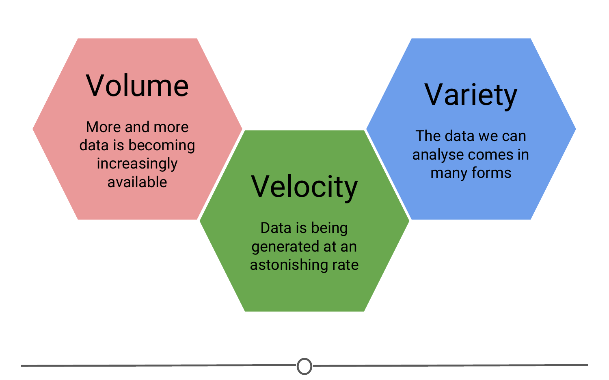

# Welcome to the Data Scientist's Toolbox

Hello, and welcome to The Data Scientist's Toolbox, the first course in the Data Science Specialization series. Here, we will be going over the basics of data science and introducing you to the tools that will be used throughout the series.

### What is data science? 

So the first question you probably need answered going into this course is, "What is Data Science?" - and that is a great question. To different people, this means different things, but at its core, data science is using data to answer questions. This is a pretty broad definition, and that's because it's a pretty broad field!

Data science can involve: 

- Statistics, computer science, mathematics  

- Data cleaning and formatting  

- Data visualization  

[An Economist Special Report](http://www.economist.com/node/15557443) sums up this melange of skills well - they state that a data scientist is broadly defined as someone:  

> "who combines the skills of software programmer, statistician and storyteller slash artist to extract the nuggets of gold hidden under mountains of data"

And by the end of these courses, hopefully you will feel equipped to do just that!

### Why do we need data science? 

One of the reasons for the [rise of data science](https://www.forbes.com/sites/gilpress/2013/05/28/a-very-short-history-of-data-science/#2caa3a5055cf) in recent years is the vast amount of data currently available and being generated. Not only are massive amounts of data being collected about many aspects of the world and our lives, but we simultaneously have the rise of inexpensive computing. This has created the perfect storm in which we have rich data and the tools to analyse it: Rising computer memory capabilities, better processors, more software and now, more data scientists with the skills to put this to use and answer questions using this data!

There is a little anecdote that describes the truly exponential growth of data generation we are experiencing. In the third century BC, the Library of Alexandria was believed to house the sum of human knowledge. Today, there is enough information in the world to give every person alive 320 times as much of it as historians think was stored in Alexandria’s entire collection.

And that is still growing.
   
### What is big data? 

We'll talk a little bit more about big data in a later lecture, but it deserves an introduction here - since it has been so integral to the [rise of data science](https://www.foreignaffairs.com/articles/2013-04-03/rise-big-data). 
There are a [few qualities that characterize big data](https://www.forbes.com/sites/oreillymedia/2012/01/19/volume-velocity-variety-what-you-need-to-know-about-big-data/#6749ab021b6d). The first is **volume**. As the name implies, big data involves large datasets - and these large datasets are becoming more and more routine. For example, say you had a question about online video - well, YouTube has approximately 300 hours of video uploaded every minute! You would definitely have a lot of data available to you to analyse, but you can see how this might be a difficult problem to wrangle all of that data! 

And this brings us to the second quality of big data: **velocity**. Data is being generated and collected faster than ever before. In our YouTube example, new data is coming at you every minute! In a completely different example, say you have a question about shipping times or routes. Well, most transport trucks have real time GPS data available - you could in real time analyse the trucks movements... if you have the tools and skills to do so! 

The third quality of big data is **variety**. In the examples I've mentioned so far, you have different types of data available to you. In the YouTube example, you could be analysing video or audio, which is a very unstructured data set, or you could have a database of video lengths, views or comments, which is a much more structured dataset to analyse. 

### What is a data scientist? 

So we've talked about what data science is and what sorts of data it deals with, but something else we need to discuss is what exactly a data scientist *is*. 

The most basic of definitions would be that a data scientist is somebody who uses data to answer questions. But more importantly to you, what skills does a data scientist embody? 

And to answer this, we have this [illustrative Venn diagram](http://drewconway.com/zia/2013/3/26/the-data-science-venn-diagram), in which data science is the intersection of three sectors - Substantive expertise, hacking skills, and math and statistics. 

To explain a little on what we mean by this, we know that we use data science to answer questions - so first, we need to have enough expertise in the area that we want to ask about in order to formulate our questions and to know what sorts of data are appropriate to answer that question. Once we have our question and appropriate data, we know from the sorts of data that data science works with, often times it needs to undergo significant cleaning and formatting - and this often takes computer programming slash "hacking" skills. Finally, once we have our data, we need to analyse it, and this often takes math and stats knowledge. 

In this specialization, we'll spend a bit of time focusing on each of these three sectors, but will primarily focus on math and statistics knowledge and hacking skills. For hacking skills, we'll focus on teaching two different components: computer programming or at least computer programming with R, which will allow you to access data, play around with it, analyze it, and plot it. Additionally, we'll focus on having you learn how to go out and get answers to your programming questions. 

One reason data scientists are in such demand is that most of the answers aren't already outlined in textbooks - a data scientist needs to be somebody who knows how to find answers to novel problems.

### Why do data science?  

Speaking of that demand, there is a huge need for individuals with data science skills. Not only are machine learning engineers, data scientists, and big data engineers among the top emerging jobs in 2017 [according to LinkedIn](https://economicgraph.linkedin.com/research/LinkedIns-2017-US-Emerging-Jobs-Report), the demand far exceeds the supply.

> Data scientist roles have grown over 650 percent since 2012, but currently 35,000 people in the US have data science skills, while hundreds of companies are hiring for those roles - even those you may not expect in sectors like retail and finance - supply of candidates for these roles cannot keep up with demand.

This is a great time to be getting in to data science - not only do we have more and more data, and more and more tools for collecting, storing, and analysing it, but the demand for data scientists is becoming increasingly recognized as important in many diverse sectors, not just business and academia. 

Additionally, according to [Glassdoor]( https://www.glassdoor.com/List/Best-Jobs-in-America-LST_KQ0,20.htm), in which they ranked the top 50 best jobs in America, Data Scientist is **THE** top job in the US in 2017, based on job satisfaction, salary, and demand. 

### Examples of data scientists

The diversity of sectors in which data science is being used is exemplified by looking at examples of data scientists. 

One place we might not immediately recognize the demand for data science is in sports – [Daryl Morey]( https://twitter.com/dmorey) is the general manager of a US basketball team, the Houston Rockets. [Despite not having a strong background in basketball](http://www.nytimes.com/2008/01/28/sports/basketball/28morey.html), Morey was awarded the job as GM on the basis of his bachelor's degree in computer science and his M.B.A. from M.I.T. He was chosen for his ability to collect and analyse data, and use that to make informed hiring decisions. 

Another data scientist that you may have heard of is [Hilary Mason](https://hilarymason.com). She is a co-founder of FastForward labs, a machine learning company recently acquired by Cloudera, a data science company, and is the Data Scientist in Residence at Accel. Broadly, she uses data to answer questions about mining the web and understanding the way that humans interact with each other through social media. 

And finally, Nate Silver is one of the most famous data scientists or statisticians in the world today. He is founder and editor in chief at [FiveThirtyEight](http://fivethirtyeight.com/) - A website that  

> uses statistical analysis - hard numbers - to tell compelling stories about elections, politics, sports, science, economics and lifestyle.

He uses large amounts of totally free public data to make predictions about a variety of topics; most notably he makes predictions about who will win elections in the United States, and has a remarkable track record for accuracy doing so. 

### Data science in action! 

One great example of data science in action is from 2009, in which researchers at Google analysed 50 million commonly searched terms over a five year period, and compared them against CDC data on flu outbreaks. Their goal was to see if certain searches coincided with outbreaks of the flu. One of the benefits of data science and using big data is that it can identify correlations; in this case, they identified 45 words that had a strong correlation with the CDC flu outbreak data. With this data, they have been able to predict flu outbreaks based solely off of common Google searches! Without this mass amounts of data, these 45 words could not have been predicted beforehand. 

### What will we teach you in this course? 

Now that you have had this introduction into data science, all that really remains to cover here is a summary of what it is that we will be teaching you throughout this course. To start, we'll go over the basics of R. R is the main programming language that we will be working with in this course track, so a solid understanding of what it is, how it works and getting it installed on your computer is a must. We'll then transition into RStudio - which is a very nice graphical interface to R, that should make your life easier! We'll then talk about version control, why it is important and how to integrate it into your work. And once you have all of these basics down, you'll be all set to apply these tools to answering your very own data science questions! 

Looking forward to learning with you! Let's get to it! 