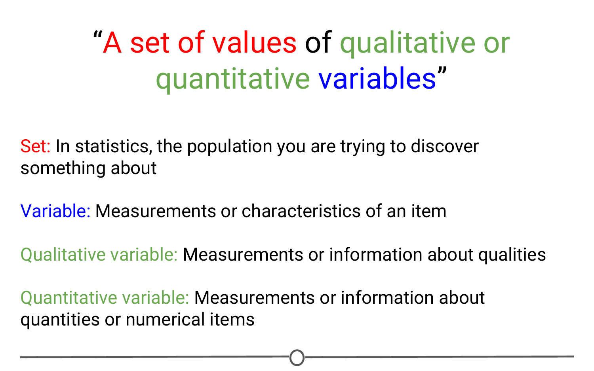
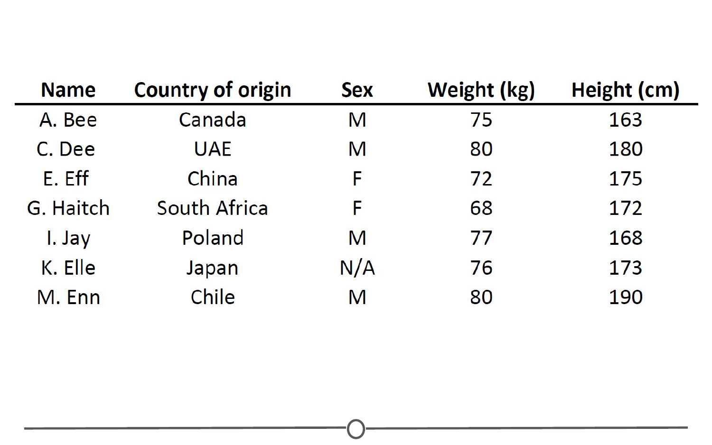
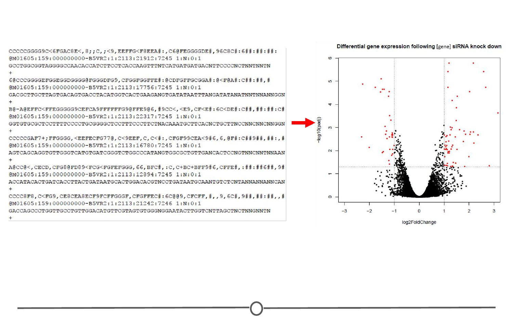
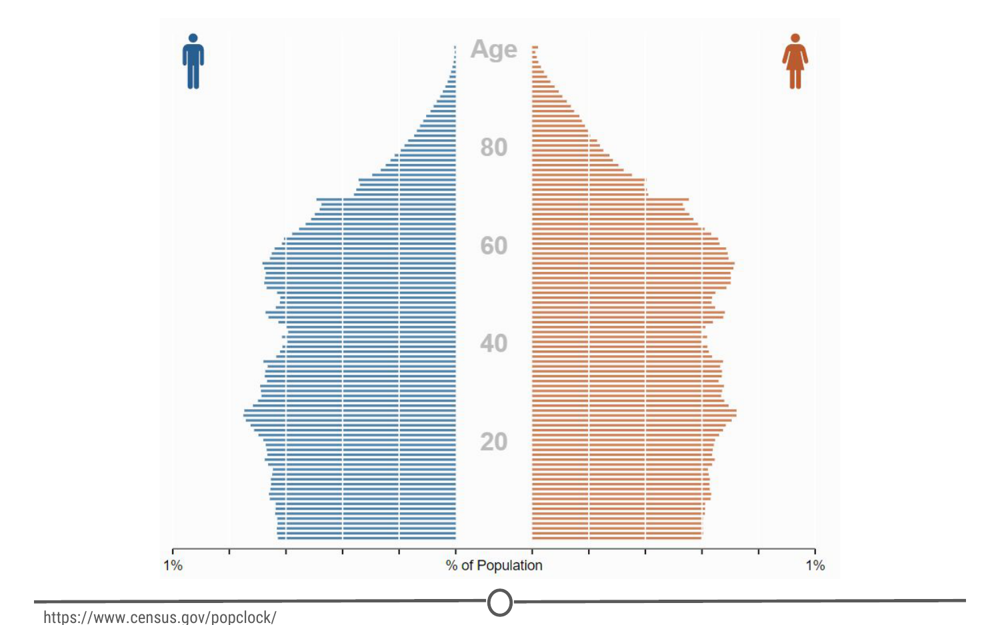

# What is data? 

Since we've spent some time discussing what data science is, we should spend some time looking at what exactly data _is_.

### Definitions of "data"  

First, let's look at what a few trusted sources consider data to be.  

First up, we'll look at the [Cambridge English Dictionary](https://dictionary.cambridge.org/dictionary/english/data){target="_blank"}, which states that data is:  

> Information, especially facts or numbers, collected to be examined and considered and used to help decision-making.  
  
Second, we'll look at the definition provided by [Wikipedia](https://en.wikipedia.org/wiki/Data){target="_blank"}, which is:  

> A set of values of qualitative or quantitative variables.  

These are slightly different definitions and they get at different components of what data is. Both agree that data is values or numbers or facts, but the Cambridge definition focuses on the actions that surround data - data is collected, examined and most importantly, used to inform decisions. We've focused on this aspect before - we've talked about how the most important part of data science is the question and how all we are doing is using data to answer the question. The Cambridge definition focuses on this. 

The Wikipedia definition focuses more on what data entails. And although it is a fairly short definition, we'll take a second to parse this and focus on each component individually. 

So, the first thing to focus on is **"a set of values"** - to have data, you need a set of items to measure from. In statistics, this set of items is often called the population. The set as a whole is what you are trying to discover something about. For example, that set of items required to answer your question might be all websites or it might be the set of all people coming to websites, or it might be a set of all people getting a particular drug. But in general, it's a set of things that you're going to make measurements on.

The next thing to focus on is **"variables"** - variables are measurements or characteristics of an item. For example, you could be measuring the height of a person, or you are measuring the amount of time a person stays on a website. On the other hand, it might be a more qualitative characteristic you are trying to measure, like what a person clicks on on a website, or whether you think the person visiting is male or female.

Finally, we have both **qualitative and quantitative** variables. Qualitative variables are, unsurprisingly, information about qualities. They are things like country of origin, sex, or treatment group. They're usually described by words, not numbers, and they are not necessarily ordered. Quantitative variables on the other hand, are information about quantities. Quantitative measurements are usually described by numbers and are measured on a continuous, ordered scale; they're things like height, weight and blood pressure.

So, taking this whole definition into consideration we have measurements (either qualitative or quantitative) on a set of items making up data - not a bad definition. 

### What can data look like? (rarely)

When we were going over the definitions, our examples of variables and measurements (country of origin, sex, height, weight) are pretty basic examples; you can easily envision them in a nice looking spreadsheet, with individuals along one side of the table, and the information for those variables along the other side. 

Unfortunately, this is rarely how data is presented to you. The data sets we commonly encounter are much messier, and it is our job to extract the information we want, corral it into something tidy like the imagined table above, analyse it appropriately, and often, visualize our results. 

### More common types of messy data

Here are just some of the data sources you might encounter and we'll briefly look at what a few of these data sets often look like or how they can be interpreted, but one thing they have in common is the messiness of the data - you have to work to extract the information you need to answer your question. 

- Sequencing data 

- Population census data

- Electronic medical records (EMR), other large databases

- Geographic information system (GIS) data (mapping)

- Image analysis and image extrapolation

- Language and translations 

- Website traffic

- Personal/Ad data (eg: Facebook, Netflix predictions, etc)

### Messy data: Sequencing 

One type of data, that I work with regularly, is [sequencing data](https://www.ncbi.nlm.nih.gov/sra){target="_blank"}. This data is generally first encountered in the FASTQ format, the raw file format produced by sequencing machines. These files are often hundreds of millions of lines long, and it is our job to parse this into an understandable and interpretable format and infer something about that individual's genome. In this case, this data was interpreted into expression data, and produced a plot called a "volcano plot".

### Messy data: Census information

One rich source of information is country wide censuses. In these, almost all members of a country answer a set of standardized questions and submit these answers to the government. When you have that many respondants, the data is large and messy; but once this large database is ready to be queried, the answers embedded are important.Here we have a very basic result of the last US census - in which all respondants are divided by sex and age, and this distribution is plotted in this population pyramid plot. 

[Here](https://www.census.gov/popclock/){target="_blank"} is the US census website and [some tools to help you examine it](http://guides.library.ucla.edu/c.php?g=180339&p=1189478){target="_blank"}, but if you aren't from the US, I urge you to check out your home country's census bureau (if available) and look at some of the data there!  

### Messy data: Electronic medical records (EMR)

Electronic medical records are increasingly prevalent as a way to store health information, and more and more population based studies are using this data to answer questions and make inferences about populations at large, or as a method to identify ways to improve medical care. For example, if you are asking about a population's common allergies, you will have to extract many individuals' allergy information, and put that into an easily interpretable table format where you will then perform your analysis. 

### Messy data: Image analysis/extrapolation

A more complex data source to analyse are images/videos. There is a wealth of information coded in an image or video, and it is just waiting to be extracted. An example of image analysis that you may be familiar with is when you upload a picture to Facebook and not only does it automatically recognize faces in the picture, but then suggests who they may be. A fun example you can play with is the [DeepDream software](https://deepdreamgenerator.com/){target="_blank"} that was originally designed to detect faces in an image, but has since moved on to more _artistic_ pursuits. 

There is another fun Google initiative involving image analysis, where you help provide data to Google's machine learning algorithm... [by doodling!](https://quickdraw.withgoogle.com/){target="_blank"}

### Data is of secondary importance

Recognizing that we've spent a lot of time going over what data is, we need to reiterate - Data is important, but it is secondary to your question. A good data scientist asks questions first and seeks out relevant data second. 

Admittedly, often the data available will limit, or perhaps even enable, certain questions you are trying to ask. In these cases, you may have to reframe your question or answer a related question, but the data itself does not drive the question asking. 

### Summary

In this lesson we focused on data - both in defining it and in exploring what data may look like and how it can be used. 

First, we looked at two definitions of data, one that focuses on the actions surrounding data, and another on what comprises data. The second definition embeds the concepts of populations, variables, and looks at the differences between quantitative and qualitative data. 

Second, we examined different sources of data that you may encounter, and emphasized the lack of tidy datasets. Examples of messy datasets, where raw data needs to be wrangled into an interpretable form, can include sequencing data, census data, electronic medical records, etc. 
And finally, we return to our beliefs on the relationship between data and your question and emphasize the importance of question-first strategies. You could have all the data you could ever hope for, but if you don't have a question to start, the data is useless.