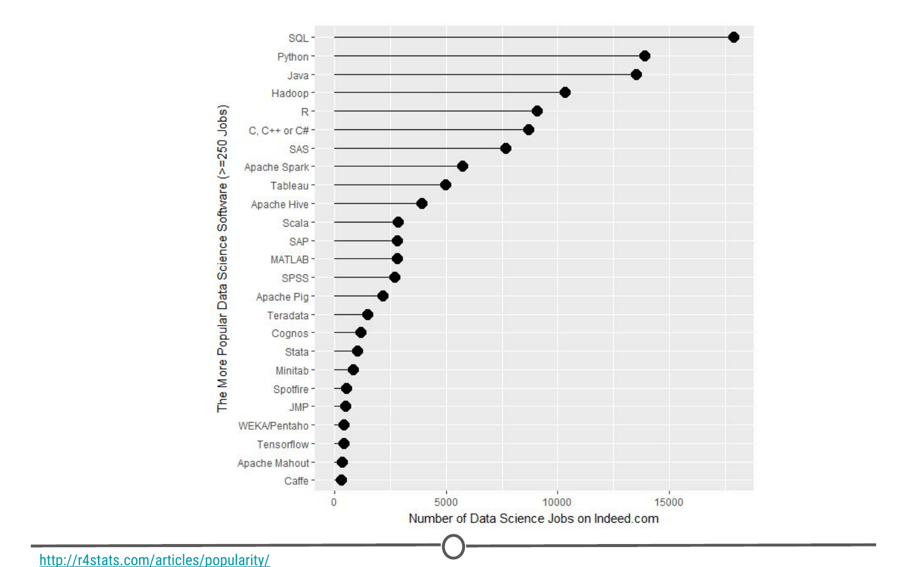
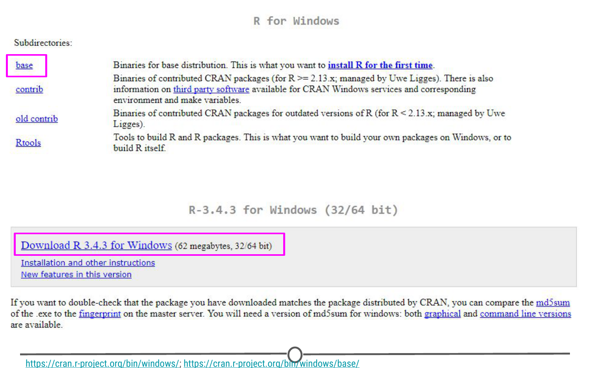
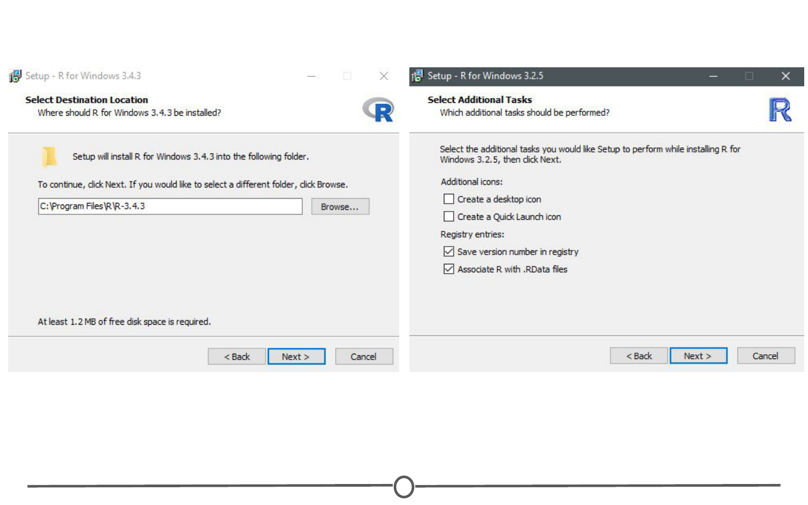
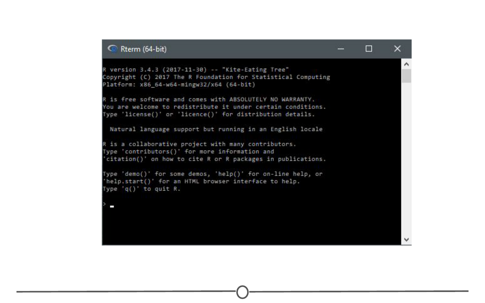
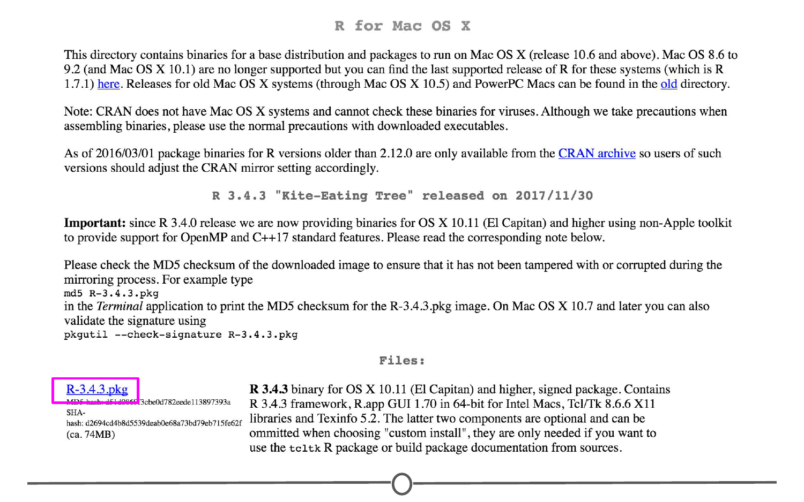
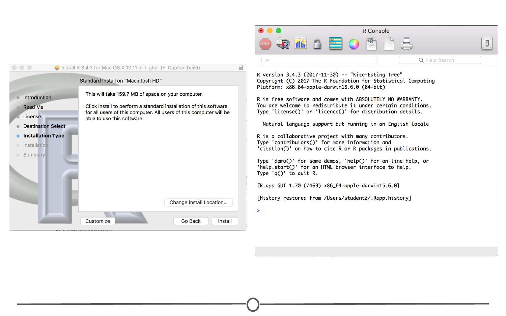

# Installing R 

Now that we've got a handle on what a data scientist is, how to find answers, and then spent some time going over a data science example, it's time to get you set up to start exploring on your own. And the first step of that is installing R. 

### What is R? What is CRAN?

First, let's remind ourselves exactly what R is and why we might want to use it. 

[R](https://www.r-project.org/){target="_blank"} is both a programming language and an environment, focused mainly on statistical analysis and graphics. It will be one of the main tools you use in this and following courses. 

R is downloaded from the [Comprehensive R Archive Network](https://cran.r-project.org/){target="_blank"}, or CRAN, and while this might be your first brush with it, we will be returning to CRAN time and time again, when we install packages - so keep an eye out! 

### Why should you use R? 

Outside of this course, you may be asking yourself - [why should I use R?](https://www.r-bloggers.com/why-use-r-five-reasons/){target="_blank"} 

The reasons for using R are myriad, but some big ones are:  

**1) Its popularity**

R is quickly becoming the standard language for statistical analysis. This makes R a great language to learn as the more popular a software is, the quicker new functionality is developed, the more powerful it becomes, and the better the support there is! Additionally, as you can see in the [graph below](http://r4stats.com/articles/popularity/){target="_blank"}, knowing R is one of the top five languages asked for in data scientist job postings!

**2) Its cost**

FREE!

This one is pretty self-explanatory - every aspect of R is free to use, unlike some other stats packages you may have heard of (eg: SAS, SPSS), so there is no cost barrier to using R! 

**3) Its extensive functionality** 

R is a very versatile language - we've talked about its use in stats and in graphing, but its use can be expanded to many different functions - from making [websites](http://rmarkdown.rstudio.com/rmarkdown_websites.html){target="_blank"}, making maps using [GIS data](http://www.nickeubank.com/gis-in-r/){target="_blank"}, analysing [language](https://cran.r-project.org/web/views/NaturalLanguageProcessing.html){target="_blank"}... and even making these [lectures and videos](https://cran.r-project.org/web/packages/ari/index.html){target="_blank"}! For whatever task you have in mind, there is often a package available for download that does exactly that! 

**4) Its community**

And the reason that the functionality of R is so extensive is the community that has been built around R. Individuals have come together to make "packages" that add to the functionality of R - and more are being developed every day!

Particularly for people just getting started out with R, its community is a huge benefit - due to its popularity, there are multiple forums that have pages and pages dedicated to solving R problems. We talked about this in the Getting Help lesson; these forums are great both for finding other people who have had the same problem as you, and posting your own new problems. 

### Installing R

Now that we've spent some time looking at the benefits of R, it is time to install it! We'll go over installation for both Windows and Mac below, but know that these are general guidelines and small details are likely to change subsequent to the making of this lecture - use this as a scaffold.

For both Windows and Mac machines, we start at the CRAN homepage: [https://cran.r-project.org/](https://cran.r-project.org/){target="_blank"}

### Installation - for Windows

If you are on a Windows computer, follow the link [Download R for Windows](https://cran.r-project.org/bin/windows/){target="_blank"}, and follow the directions there - if this is your first time installing R, go to the [base distribution](https://cran.r-project.org/bin/windows/base/){target="_blank"} and click on the link at the top of the page that should say something like "Download R [version number] for Windows." This will download an executable file for installation. 

Open the executable, and if prompted by a security warning, allow it to run. Select the language you prefer during installation and agree to the licensing information. You will next be prompted for a destination location - this will likely be defaulted to Program Files, in a subfolder called R, followed by another directory of the version number. Unless you have any issues with this, the default location is perfect. 

You will then be prompted to select which components should be installed. Unless you are running short on memory, installing all of the components is desireable. Next you'll be asked about startup options, and again, the defaults are fine for this. You will then be asked where Setup should place shortcuts - this is completely up to you, you can allow it to add the program to the start menu, or you can click the box at the bottom that says to not create a start menu link. Finally, you will be asked whether you want a desktop or Quick Launch icon - up to you! I do not recommend changing the defaults for the registry entries though. 

After this window, the installation should begin. Test that the installation worked by opening R for the first time! 

### Installation - for Macs

If you are on a Mac computer, follow the link [Download R for (Mac) OS X](https://cran.r-project.org/bin/macosx/){target="_blank"}. There you can find the various R versions for download. Note: If your Mac is older than OS X 10.6 ("Snow Leopard"), you will need to follow the directions on this page for downloading older versions of R that are compatible with those operating systems. 

Click on the link to the most recent version of R, which will download a .pkg file. 

Open the pkg file and follow the prompts as provided by the installer. First, click continue on the welcome page and again on the important information window page. Next you will be presented with the software license agreement, again, continue. Next you may be asked to select a destination for R, either available to all users or to a specific disk - select whichever you feel is best suited to your setup. Finally, you will be at the "Standard Install" page; R selects a default directory and if you are happy with that location, go ahead and click install. At this point, you may be prompted to type in the admin password, do so, and the install will begin! 

Once the installation is finished, go to your Applications and find R. Test that the installation worked by opening R for the first time! 

### Summary

In this lesson we first looked at what R is and why we might want to use it. We then focused on the installation process for R on both Windows and Mac computers. Before moving on to the next lecture, be sure that you have R installed properly. 