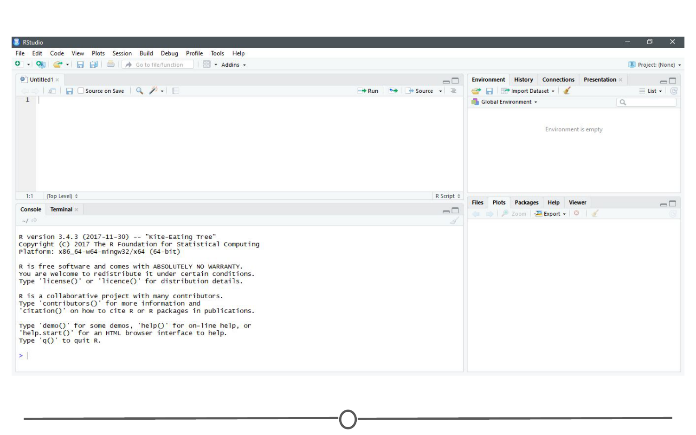

# Installing RStudio

We've installed R and can open the R interface to input code, but there are other ways to interface with R - and one of those ways is using RStudio. In this lesson, we'll get RStudio installed on your computer.

### What is RStudio? 

[RStudio](https://www.rstudio.com/products/RStudio/) is a graphical user interface for R, that allows you to write, edit and store code, generate, view and store plots, manage files, objects and dataframes, and integrate with version control systems -- to name a few of its functions. We will be exploring exactly what RStudio can do for you in future lessons, but for anybody just starting out with R coding, the visual nature of this program as an interface for R is a huge benefit.

### Installing RStudio  

Thankfully, installation of RStudio is fairly straightforward. First, you go to the [RStudio download page](https://www.rstudio.com/products/rstudio/download/https://www.rstudio.com/products/rstudio/download/). We want to download the RStudio Desktop version of the software, so click on the appropriate "Download" , under that heading and you will see a list of ["Installers for supported platforms"](https://www.rstudio.com/products/rstudio/download/#download). 

At this point the installation process diverges for Macs and Windows, so follow the instructions for the appropriate OS. 

### Installing RStudio - Windows 

For Windows, select the RStudio installer for the various Windows editions (Vista, 7, 8, 10). This will initiate the download process. When the download is complete, open this executable file to access the installation wizard. You may be presented with a security warning at this time - allow it to make changes to your computer.

Following this, the installation wizard will open. Following the defaults on each of the windows of the wizard is appropriate for installation. In brief, on the welcome screen, click next. If you want RStudio installed elsewhere, "Browse" through your file system. Otherwise, it will likely default to the "Program Files" folder - this is appropriate. Click next. On this final page, allow RStudio to create a Start menu shortcut. Click Install. RStudio is now being installed. Wait for this process to finish; RStudio is now installed on your computer. Click Finish. 

Check that RStudio is working appropriately by opening it from your Start menu. 

### Installing RStudio - Macs

For Macs, select the Macs OS X RStudio installer (Mac OS X 10.6+ (64-bit)). This will initiate the download process. When the download is complete, click on the downloaded file and it will begin to install. When this is finished, the applications window will open. Drag the RStudio icon into the Applications directory. Test the installation by opening your applications folder and opening the RStudio software.

### Summary

In this lesson we installed RStudio, both for Macs and for Windows computers. Before moving on to the next lecture, click through the available menus and explore the software a bit. We will have an entire lesson dedicated to exploring RStudio, but having some familiarity beforehand will be helpful! 