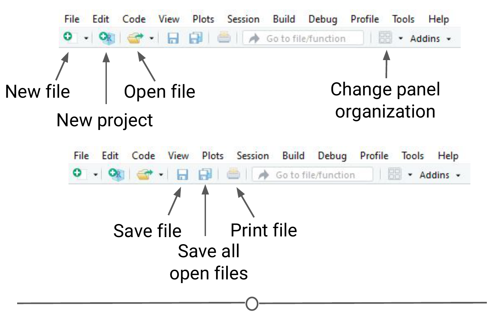

# RStudio Tour 

Now that we have RStudio installed, we should familiarize ourselves with the various components and functionality of it! RStudio provides a cheatsheet of the [RStudio environment](https://github.com/rstudio/cheatsheets/raw/master/rstudio-ide.pdf){target="_blank"} - warning: this link initiates a download of a PDF from the RStudio GitHub. 

### The various quadrants

Rstudio can be roughly divided into four quadrants, each with specific and varied functions, plus a main menu bar. When you first open RStudio, you should see a window that looks roughly like this: 

You may be missing the upper left quadrant and instead have the left side of the screen with just one region, "Console" - if this is the case, go to File > New File > R Script and now it should more closely resemble the image. You can change the sizes of each of the various quadrants by hovering your mouse over the spaces between quadrants and click-dragging the divider to resize the sections. 

We will go through each of the regions and describe some of their main functions. It would be impossible to cover everything that RStudio can do, so we urge you to explore RStudio on your own too! 

### The menu bar

The menu bar runs across the top of your screen and should have two rows. The first row should be a fairly standard menu, starting with "File" and "Edit." Below that, there is a row of icons that are shortcuts for functions that you'll frequently use. 

To start, let's explore the main sections of the menu bar that you will use. The first being the File menu. Here we can open new or saved files, open new or saved projects (we'll have an entire lesson in the future about R Projects, so stay tuned!), save our current document or close RStudio. If you mouse over "New File", a new menu will appear that suggests the various file formats available to you. R Script and R Markdown files are the most common file types for use, but you can also generate R notebooks, web apps, websites, or slide presentations. If you click on any one of these, a new tab in the "Source" quadrant will open. We'll spend more time in a future lesson on R Markdown files and their use. 

The Session menu has some R specific functions, in which you can restart, interrupt or terminate R - these can be helpful if R isn't behaving or is stuck and you want to stop what it is doing and start from scratch. 

The Tools menu is a treasure trove of functions for you to explore. For now, you should know that this is where you can go to install new packages (see next lecture), set up your version control software (see future lesson: Linking GitHub and RStudio), and set your options and preferences for how RStudio looks and functions. For now, we will leave this alone, but be sure to explore these menus on your own once you have a bit more experience with RStudio and see what you can change to best suit your preferences! 

### The console

This region should look familiar to you - when you opened R, you were presented with the console. This is where you type and execute commands, and where the output of said command is displayed. 

To execute your first command, try typing `1 + 1` then enter at the `>` prompt. You should see the output `[1] 2` below your command. 

Now copy and paste the following into your console and hit enter. 

`example <- matrix(c(1, 2, 3, 4, 5, 6, 7, 8), nrow = 4, ncol = 2)`

This creates a matrix with four rows and two columns, with the numbers 1 through 8. 

### The environment/history

To view this matrix, first look to the Environment quadrant, where you should see the following: 

Click anywhere on the "example" line, and a new tab on the Source quadrant should appear, showing the matrix you created. Any dataframe or matrix that you create in R can be viewed this way in RStudio.

RStudio also tells you some information about the object in the environment, like whether it is a list or a dataframe or if it contains numbers, integers or characters. This is very helpful information to have as some functions only work with certain classes of data. And knowing what kind of data you have is the first step to that. 

The quadrant has two other tabs running across the top of it. We'll just look at the History tab now. Your history tab should look something like this: 

Here you will see the commands that we have run in this session of R. If you click on any one of them, you can click "To Console" or "To Source" and this will either rerun the command in the console, or will move the command to the source, respectively. Do so now for your `example` matrix and send it to Source. 

### The source/The script editor panel 

The Source panel is where you will be spending most of your time in RStudio. This is where you store the R commands that you want to save for later, either as a record of what you did or as a way to rerun code. We'll spend a lot of time in this quadrant when we discuss R Markdown, but for now, click the save icon along the top of this quadrant and save the script as `my_first_R_script.R` Now you will always have a record of creating this matrix.

### Files/help/plots/packages panel

The final region we'll look at occupies the bottom right of the RStudio window. In this quadrant, five tabs run across the top: Files, Plots, Packages, Help, and Viewer. 

In Files, you can see all of the files in your current working directory. If this isn't where you want to save or retrieve files from, you can also change the current working directory in this tab using the ellipsis at the far right, finding the desired folder, and then under the "More" cogwheel, setting this new folder as the working directory. 

In the Plots tab, if you generate a plot with your code, it will appear here. You can use the arrows to navigate to previously generated plots. The Zoom function will open the plot in a new window, that is much larger than the quadrant. Export is how you save the plot. You can either save it as an image or as a PDF. The broom icon clears all plots from memory. 

The Packages tab will be explored more in depth in the next lesson on R packages. Here you can see all the packages you have installed, load and unload these packages, and update them. 

The Help tab is where you find the documentation for your R packages and various functions. In the upper right of this panel there is a search function for when you have a specific function or package in question. 

### Summary

In this lesson we took a tour of the RStudio software. We became familiar with the main menu and its various menus. We looked at the Console, where R code is input and run. We then moved on to the Environment panel that lists all of the objects that have been created within an R session and allows you to view these objects in a new tab in Source. In this same quadrant, there is a History tab, that keeps a record of all commands that have been run. It also presents the option to either rerun the command in the Console, or send the command to Source, to be saved. Source is where you save your R commands. And the bottom right quadrant contains a listing of all the files in your working directory, displays generated plots, lists your installed packages, and supplies help files for when you need some assistance! Take some time to explore RStudio on your own!