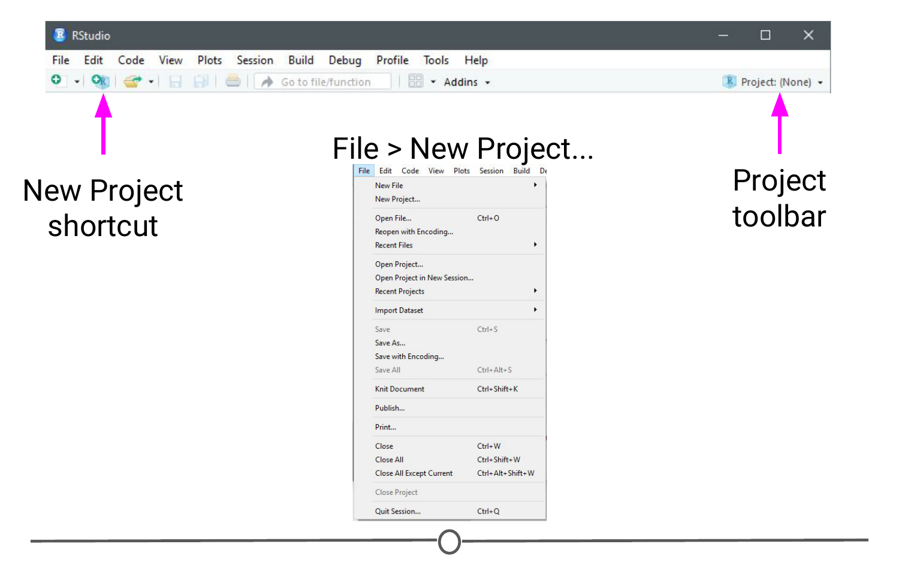
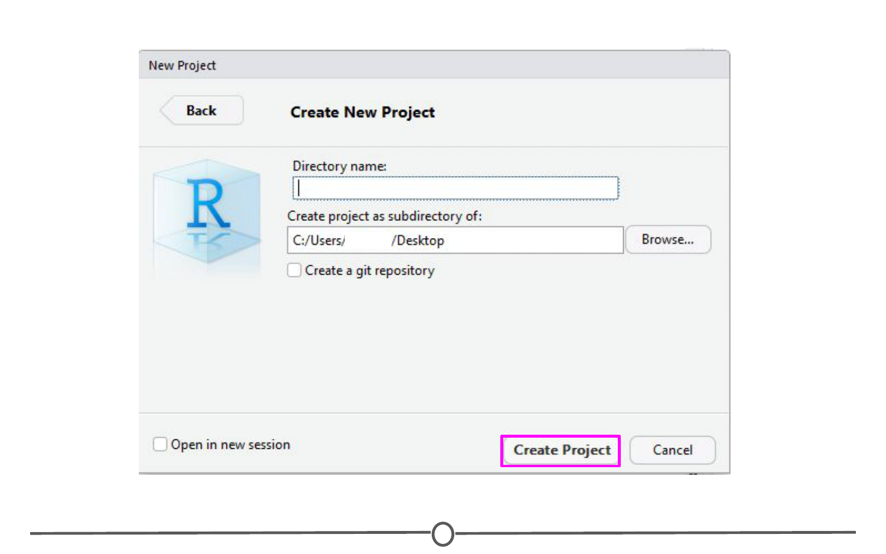
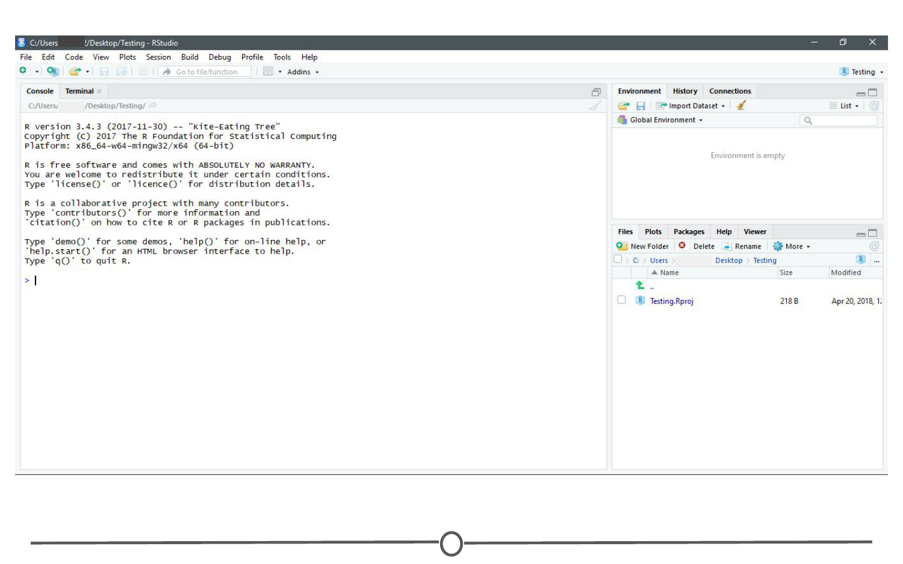

# R Projects 

One of the ways people organize their work in R is through the use of R Projects, a built in functionality of RStudio that helps to keep all your related files together. RStudio provides a [great guide](https://support.rstudio.com/hc/en-us/articles/200526207-Using-Projects){target="_blank"} on how to use Projects so definitely check that out! 

### What is an R Project? 

When you make a Project, it creates a folder where all files will be kept, which is helpful for organizing yourself and keeping multiple projects separate from each other. When you re-open a project, RStudio remembers what files were open and will restore the work environment as if you had never left - which is very helpful when you are starting back up on a project after some time off! Functionally, creating a Project in R will create a new folder and assign that as the working directory so that all files generated will be assigned to the same directory. 

### What are the benefits to using Projects? 

The main benefit of using Projects is that it starts the organization process off right! It creates a folder for you and now you have a place to store all of your input data, your code, and the output of your code. Everything you are working on within a Project is self-contained; which often means finding things is much easier - there's only one place to look! 

Also, since everything related to one project is all in the same place, it is much easier to share your work with others - either by directly sharing the folder/files, or by associating it with version control software. We'll talk more about linking Projects in R with version control systems in a future lesson entirely dedicated to the topic!

Finally, since RStudio remembers what documents you had open when you closed the session, it is easier to pick a project up after a break - everything is set-up just as you left it!

### Creating a Project

There are three ways to make a Project:  
1) From scratch - this will create a new directory for all your files to go in   
2) From an existing folder - this will link an existing directory with RStudio  
3) From version control - this will "clone" an existing project onto your computer (Don't worry too much about this one, you'll get more familiar with it in the next few lessons)  

Let's create a Project from scratch, which is often what you will be doing! 

Open RStudio, and under File, select "New Project". You can also create a new Project by using the Projects toolbar and selecting "New Project" in the drop down menu, or there is a "New Project" shortcut in the toolbar. 

Since we are starting from scratch, select "New Project" and a window will appear. Select "New Directory" and when prompted about the Project type, select "New Project"

Pick a name for your project and for this time, save it to your Desktop. This will create a folder on your Desktop where all of the files associated with this Project will be kept. Click "Create Project."

A blank RStudio session should open. 

A few things to note:  
1) In the "Files" quadrant of the screen, you can see that RStudio has made this new directory your working directory and generated a single file with the extension ".Rproj"  
2) In the upper-right of the window, there is a Projects toolbar that states the name of your current Project and has a drop down menu with a few different options that we'll talk about in a second. 

### Opening a project

Opening an existing Project is as simple as double clicking the .Rproj file on your computer. You can accomplish the same from within RStudio by opening RStudio and going to File > Open Project. You can also use the Project toolbar and open the drop down menu and select "Open Project..."

### Quitting a project or switching to another

Quitting a project is as simple as closing your RStudio window. You can also go to File > Close Project, and this will do the same. Finally, you can use the Project toolbar by clicking on the drop down menu and choosing "Close Project".

All of these options will quit a Project and doing so will cause RStudio to write which documents are currently open (so they can be restored when you start back up again) and it then closes the R session. When you set up your Project, you can tell it to save environment (so, for example, all of your variables and data tables will be preloaded when you reopen the project), but this is not the default behaviour. 

The Projects toolbar is also an easy way to switch between Projects - click on the drop down menu and choose "Open Project" and find your new Project you want to open - this will save the current Project, close it, and then open the new Project within the same window. If you want multiple Projects open at the same time, do the same but instead select "Open Project in New Session". This can also be accomplished through the File menu, where those same options are available. 

### Best practices

When you are setting up a project, it can be helpful to start out creating a few directories. Try a few strategies and see what works best for you, but most file structures are set-up around having a directory containing the raw data, a directory that you keep scripts/R files in, and a directory for the output of your code. 

For example: 

If you set up these folders before you start, it can save you organizational headaches later on in a project when you can't quite remember where something is! 

### Summary

In this lesson we've covered what Projects in R are, why you might want to use them, how to open, close, or switch between projects, and some best practices to best set you up for organizing yourself! 