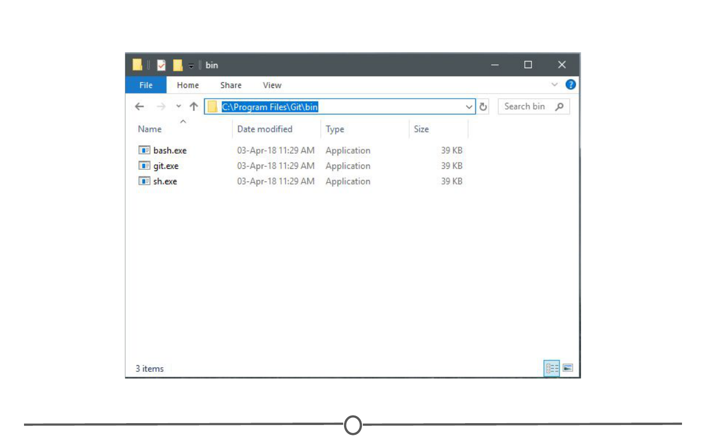
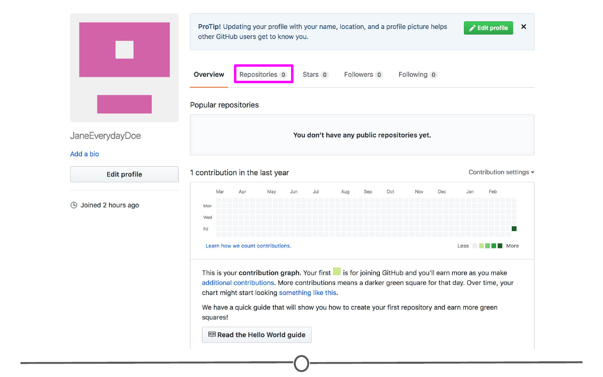

# Linking Git/GitHub and RStudio 

Now that we have both RStudio and Git set-up on your computer and a GitHub account, it's time to link them together so that you can maximize the benefits of using RStudio in your version control pipelines. 

### Linking RStudio and Git

In RStudio, go to Tools > Global Options > Git/SVN

Sometimes the default path to the Git executable is not correct. Confirm that git.exe resides in the directory that RStudio has specified; if not, change the directory to the correct path. Otherwise, click OK or Apply.

RStudio and Git are now linked. 

### Linking RStudio and GitHub 

In that same RStudio option window, click "Create RSA Key" and when this completes, click "Close."

Following this, in that same window again, click "View public key" and copy the string of numbers and letters. Close this window. 

You have now created a key that is specific to you which we will provide to GitHub, so that it knows who you are when you commit a change from within RStudio. 

To do so, go to [github.com/](https://github.com/){target="_blank"}, log-in if you are not already, and go to your account settings. There, go to "SSH and GPG keys" and click "New SSH key". Paste in the public key you have copied from RStudio into the Key box and give it a Title related to RStudio. Confirm the addition of the key with your GitHub password.

GitHub and RStudio are now linked. From here, we can create a repository on GitHub and link to RStudio.

### Create a new repository and edit it in RStudio

On GitHub, create a new repository (github.com > Your Profile > Repositories > New). Name your new test repository and give it a short description. Click Create repository. Copy the URL for your new repository.

In RStudio, go to File > New Project. Select Version Control. Select Git as your version control software. Paste in the repository URL from before, select the location where you would like the project stored. When done, click on "Create Project". Doing so will initialize a new project, linked to the GitHub repository, and open a new session of RStudio. 

Create a new R script (File > New File > R Script) and copy and paste the following code: 

`print("This file was created within RStudio")`

`print("And now it lives on GitHub")`

Save the file. Note that when you do so, the default location for the file is within the new Project directory you created earlier. 

Once that is done, looking back at RStudio, in the Git tab of the environment quadrant, you should see your file you just created! Click the checkbox under "Staged" to stage your file. 

Click "Commit". A new window should open, that lists all of the changed files from earlier, and below that shows the differences in the staged files from previous versions. In the upper quadrant, in the "Commit message" box, write yourself a commit message. Click Commit. Close the window. 

So far, you have created a file, saved it, staged it, and committed it. If you remember your version control lecture, the next step is to push your changes to your online repository. Push your changes to the GitHub repository. 

Go to your GitHub repository and see that the commit has been recorded. 

You've just successfully pushed your first commit from within RStudio to GitHub!

### Summary

In this lesson, we linked Git and RStudio, so that RStudio recognizes you are using Git as your version control software. Following that, we linked RStudio to GitHub, so that you can push and pull repositories from within RStudio. To test this, we created a repository on GitHub, linked it with a new project within RStudio, created a new file, and then staged, committed, and pushed the file to your GitHub repository!