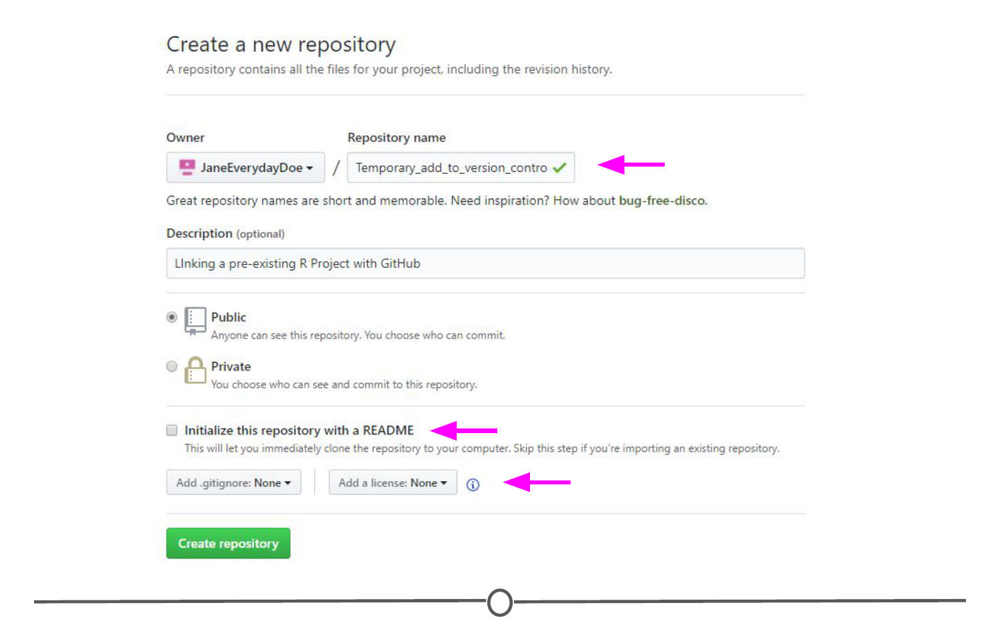

# Projects under version control 

In the previous lesson, we linked RStudio with Git and GitHub. In doing this, we created a repository on GitHub and linked it to RStudio. Sometimes, however, you may already have an R Project that isn't yet under version control or linked with GitHub. Let's fix that! 

### Linking an existing Project with Git

So what if you already have an R Project that you've been working on, but don't have it linked up to any version control software (tut tut!)?

Thankfully, RStudio and GitHub recognize this can happen and have steps in place to help you (admittedly, this is slightly more troublesome to do than just creating a repository on GitHub and linking it with RStudio before starting the project...).

So first, let's set up a situation where we have a local project that isn't under version control. Go to File > New Project > New Directory > New Project and name your project. Since we are trying to emulate a time where you have a project not currently under version control, do **NOT** click "Create a git repository". Click Create Project.

We've now created an R Project that is not currently under version control. Let's fix that. First, let's set it up to interact with Git. Open Git Bash or Terminal and navigate to the directory containing your project files. Move around directories by typing `cd ~/dir/name/of/path/to/file` 

When the command prompt in the line before the dollar sign says the correct directory location of your project, you are in the correct location. Once here, type `git init` followed by `git add .` - this initializes (*init*) this directory as a git repository and *adds* all of the files in the directory (.) to your local repository. Commit these changes to the git repository using `git commit -m "Initial commit"`

At this point, we have created an R Project and have now linked it to Git version control. The next step is to link this with GitHub.

### Linking this project with GitHub

To do this, go to GitHub.com, and again, create a new repository:  
1) Make sure the name is the **exact same** as your R project;  
2) Do **NOT** initialize a README file, .gitignore, or license. 

Upon creating the repository, you should see a page like this: 

You should see that there is an option to "Push an existing repository from the command line" with instructions below containing code on how to do so. In Git Bash or Terminal, copy and paste these lines of code to link your repository with GitHub. After doing so, refresh your GitHub page and it should now look something like the image below. 

When you re-open your project in RStudio, you should now have access to the Git tab in the upper right quadrant and can push to GitHub from within RStudio any future changes. 

### Working on an existing GitHub repository 

If there is an existing project that others are working on that you are asked to contribute to, you can link the existing project with your RStudio. It follows the exact same premise as that from the last lesson where you created a GitHub repository and then cloned it to your local computer using RStudio. In brief, in RStudio, go to File > New Project > Version Control. Select Git as your version control system, and like in the last lesson, provide the URL to the repository that you are attempting to clone and select a location on your computer to store the files locally. Create the project. 

All the existing files in the repository should now be stored locally on your computer and you have the ability to push edits from your RStudio interface. The only difference from the last lesson is that you did not create the original repository, instead you cloned somebody else's.  

### Summary 

In this lesson, we went over how to convert an existing project to be under Git version control using the command line. Following this, we linked your newly version controlled project to GitHub using a mix of GitHub commands and the command line. We then briefly recapped how to clone an existing GitHub repository to your local machine using RStudio.