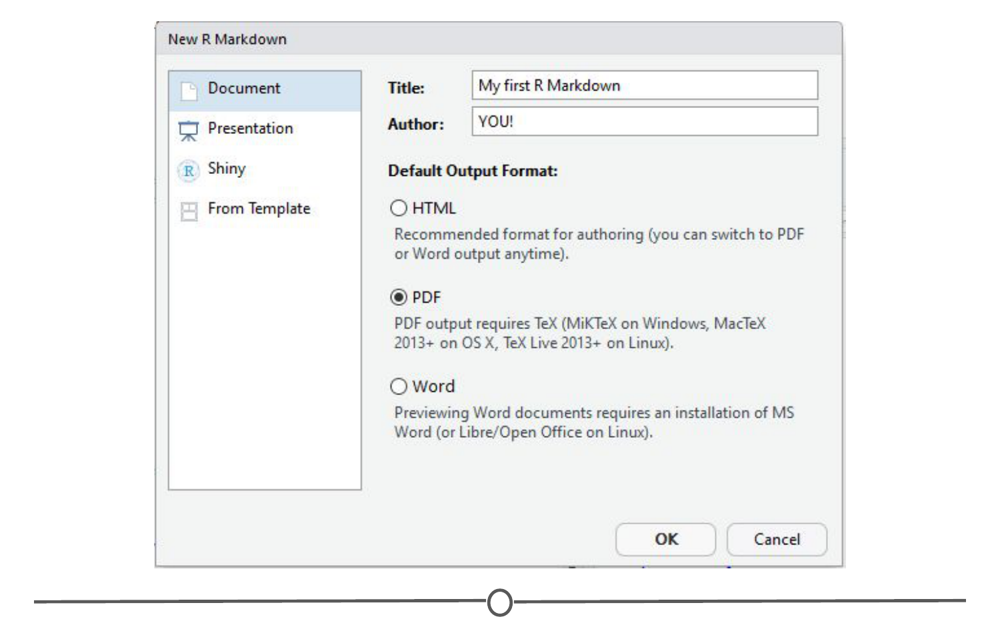
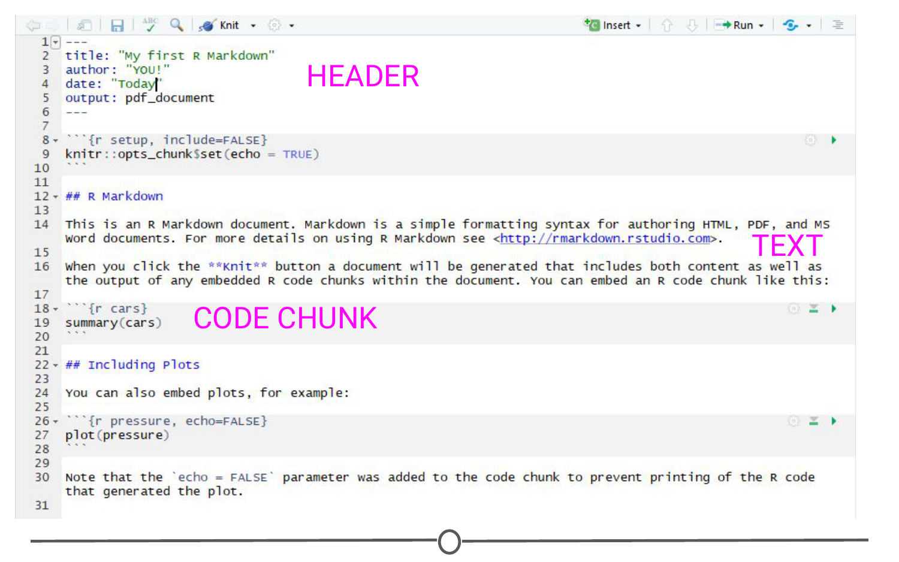
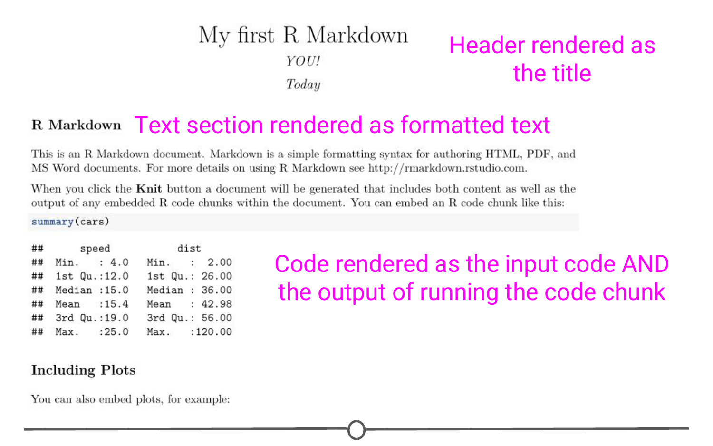

# R Markdown

We've spent a lot of time getting R and RStudio working, learning about projects and version control - you are practically an expert at this! There is one last major functionality of R/RStudio that we would be remiss to not include in your introduction to R - [Markdown!](http://rmarkdown.rstudio.com/) 

### What is R Markdown? 

R Markdown is a way of creating fully reproducible documents, in which both text and code can be combined. In fact, these lessons are written using R Markdown! That's how we make things:  

- bullets  
- **bold**  
- *italics*  
- [links](https://en.wikipedia.org/wiki/Rickrolling)  
- or run inline `r code`  

And by the end of this lesson, you should be able to do each of those things too, and more! 

Despite these documents all starting as plain text, you can render them into HTML pages, or PDFs, or Word documents, or slides! The symbols you use to signal, for example, **bold** or *italics* is compatible with all of those formats.

### Why use R Markdown?

One of the main benefits is the reproducibility of using R Markdown. Since you can easily combine text and code chunks in one document, you can easily integrate introductions, hypotheses, your code that you are running, the results of that code and your conclusions all in one document. Sharing what you did, why you did it and how it turned out becomes so simple - and that person you share it with can re-run your code and *get the exact same answers you got.* That's what we mean about reproducibility. But also, sometimes you will be working on a project that takes many weeks to complete; you want to be able to see what you did a long time ago (and perhaps be reminded exactly why you were doing this) and you can see exactly what you ran AND the results of that code - and R Markdown documents allow you to do that. 

Another major benefit to R Markdown is that since it is plain text, it works very well with version control systems. It is easy to track what character changes occur between commits; unlike other formats that aren't plain text. For example, in one version of this lesson, I may have forgotten to bold **this** word. When I catch my mistake, I can make the plain text changes to signal I would like that word bolded, and in the commit, you can see the exact character changes that occurred to now make the word bold. 

Check out [this video](https://vimeo.com/178485416) that the RStudio developers have released about R Markdown and what it is!  

### Installation

Another (selfish) benefit of R Markdown is how easy it is to use! Like everything in R, this extended functionality comes from an R package - "rmarkdown." All you need to do to install it is run `install.packages("rmarkdown")`

And that's it, you are ready to go. 

### Getting started with R Markdown

To create an R Markdown document, in R Studio, go to File > New File > R Markdown. You will be presented with the following window: 

I've filled in a title and an author and switched the output format to a PDF. Explore around this window and the tabs along the left to see all the different formats that you can output to. When you are done, click OK, and a new window should open with a little explanation on R Markdown files. 

There are three main sections of an R Markdown document. The first is the **header** at the top, bounded by the three dashes. This is where you can specify details like the title, your name, the date, and what kind of document you want output. If you filled in the blanks in the window earlier, these should be filled out for you.

Also on this page, you can see **text sections**, for example, one section starts with "## R Markdown" - We'll talk more about what this means in a second, but this section will render as text when you produce the PDF of this file - and all of the formatting you will learn generally applies to this section. 

And finally, you will see **code chunks**. These are bounded by the triple backticks. These are pieces of R code ("chunks") that you can run right from within your document - and the output of this code will be included in the PDF when you create it. 

The easiest way to see how each of these sections behave is to produce the PDF! 

### "Knitting" documents

When you are done with a document, in R Markdown, you are said to **"knit"** your plain text and code into your final document. To do so, click on the "Knit" button along the top of the source panel. When you do so, it will prompt you to save the document as an RMD file. Do so. 

You should see a document like this: 

So here you can see that the content of the header was rendered into a title, followed by your name and the date. The text chunks produced a section header called "R Markdown" which is followed by two paragraphs of text. Following this, you can see the R code `summary(cars)`, importantly, followed by the output of running that code. And further down you will see code that ran to produce a plot, and then that plot. This is one of the huge benefits of R Markdown - rendering the results to code inline.

Go back to the R Markdown file that produced this PDF and see if you can see how you signify you want text bolded. (Hint: Look at the word "Knit" and see what it is surrounded by). 

### What are some easy Markdown commands? 

At this point, I hope we've convinced you that R Markdown is a useful way to keep your code/data and have set you up to be able to play around with it. To get you started, we'll practice some of the formatting that is inherent to R Markdown documents. 

To start, let's look at bolding and italicising text. To bold text, you surround it by two asterisks on either side. Similarly, to italicise text, you surround the word with a single asterisk on either side. `**bold**` and `*italics*` respectively. 

We've also seen from the default document that you can make section headers. To do this, you put a series of hash marks (#). The number of hash marks determines what level of heading it is. One hash is the highest level and will make the largest text (see the first line of this lecture), two hashes is the next highest level and so on. Play around with this formatting and make a series of headers, like so:

`# Header level 1`  
`## Header level 2`  
`### Header level 3...`  

The other thing we've seen so far is code chunks. To make an R code chunk, you can type the three backticks, followed by the curly brackets surrounding a lower case R, put your code on a new line and end the chunk with three more backticks. Thankfully, RStudio recognized you'd be doing this a lot and there are short cuts, namely Ctrl+Alt+I (Windows) or Cmd + Option + I (Mac). Additionally, along the top of the source quadrant, there is the "Insert" button, that will also produce an empty code chunk. Try making an empty code chunk. Inside it, type the code `print("Hello world")`. When you knit your document, you will see this code chunk and the (admittedly simplistic) output of that chunk. 

If you aren't ready to knit your document yet, but want to see the output of your code, select the line of code you want to run and use Ctrl+Enter or hit the "Run" button along the top of your source window. The text "Hello world" should be output in your console window. If you have multiple lines of code in a chunk and you want to run them all in one go, you can run the entire chunk by using Ctrl+Shift+Enter OR hitting the green arrow button on the right side of the chunk OR going to the Run menu and selecting Run current chunk. 

One final thing we will go into detail on is making bulleted lists, like the one at the top of this lesson. Lists are easily created by preceding each prospective bullet point by a single dash, followed by a space. Importantly, at the end of each bullet's line, end with TWO spaces. This is a quirk of R Markdown that will cause spacing problems if not included.  

- Try  
- Making 
- Your  
- Own  
- Bullet  
- List!

This is a great starting point and there is so much more you can do with R Markdown. Thankfully, RStudio developers have produced an ["R Markdown cheatsheet"](http://www.rstudio.com/wp-content/uploads/2016/03/rmarkdown-cheatsheet-2.0.pdf) that we urge you to go check out and see everything you can do with R Markdown! The sky is the limit! 

### Summary

In this lesson we've delved into R Markdown, starting with what it is and why you might want to use it. We hopefully got you started with R Markdown, first by installing it, and then by generating and knitting our first R Markdown document. We then looked at some of the various formatting options available to you and practiced generating code and running it within the R Studio interface. 