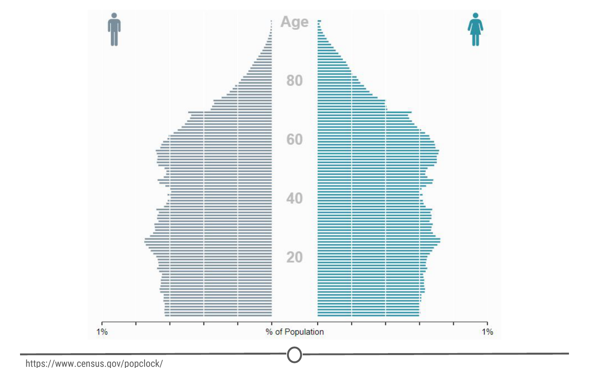
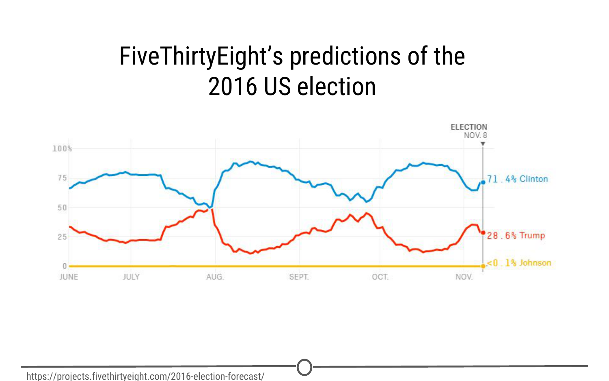

# Types of data science questions 

In this lesson, we're going to be a little more conceptual and look at some of the types of analyses data scientists employ to answer questions in data science. 

### The main divisions of data science questions 

There are, broadly speaking, six categories in which data analyses fall. In the approximate order of difficulty, they are: 

1. Descriptive  
2. Exploratory  
3. Inferential  
4. Predictive  
5. Causal  
6. Mechanistic 

Let's explore the goals of each of these types and look at some examples of each analysis! 

### 1. Descriptive analysis 

The goal of descriptive analysis is to **describe** or **summarize** a set of data. Whenever you get a new dataset to examine, this is usually the first kind of analysis you will perform. Descriptive analysis will generate simple summaries about the samples and their measurements. You may be familiar with common descriptive statistics: measures of central tendency (eg: mean, median, mode) or measures of variability (eg: range, standard deviations or variance). 

This type of analysis is aimed at summarizing your sample -- not for generalizing the results of the analysis to a larger population or trying to make conclusions. Description of data is separated from making interpretations; generalizations and interpretations require additional statistical steps. 

Some examples of purely descriptive analysis can be seen in censuses. Here, the government collects a series of measurements on all of the country's citizens, which can then be summarized. Here, you are being shown the age distribution in the US, stratified by sex. The goal of this is just to describe the distribution. There is no inferences about what this means or predictions on how the data might trend in the future. It is just to show you a summary of the data collected. 

### 2. Exploratory analysis 

The goal of exploratory analysis is to examine or **explore** the data and find **relationships** that weren't previously known. Exploratory analyses explore how different measures might be related to each other but do not confirm that relationship as causitive. You've probably heard the phrase "Correlation does not imply causation" and exploratory analyses lie at the root of this saying. Just because you observe a relationship between two variables during exploratory analysis, it does not mean that one necessarily causes the other.

Because of this, exploratory analyses, while useful for discovering new connections, should not be the final say in answering a question! It can allow you to formulate hypotheses and drive the design of future studies and data collection, but exploratory analysis alone should never be used as the final say on why or how data might be related to each other.

Going back to the census example from above, rather than just summarizing the data points within a single variable, we can look at how two or more variables might be related to each other. In the plot below, we can see the percent of the workforce that is made up of women in various sectors and how that has changed between 2000 and 2016. Exploring this data, we can see quite a few relationships. Looking just at the top row of the data, we can see that women make up a vast majority of nurses and that it has slightly decreased in 16 years. While these are interesting relationships to note, the causes of these relationships is not apparent from this analysis. All exploratory analysis can tell us is that a relationship exists, not the cause. 

### 3. Inferential analysis 

The goal of inferential analyses is to use a relatively **small sample** of data to **infer** or say something about the **population** at large. Inferential analysis is commonly the goal of statistical modelling, where you have a small amount of information to extrapolate and generalize that information to a larger group. 

Inferential analysis typically involves using the data you have to estimate that value in the population and then give a measure of your uncertainty about your estimate. Since you are moving from a small amount of data and trying to generalize to a larger population, your ability to accurately infer information about the larger population depends heavily on your sampling scheme - if the data you collect is not from a representative sample of the population, the generalizations you infer won't be accurate for the population. 

Unlike in our previous examples, we shouldn't be using census data in inferential analysis - a census already collects information on (functionally) the entire population, there is nobody left to infer to; and inferring data from the US census to another country would not be a good idea because the US isn't necessarily representative of another country that we are trying to infer knowledge about. Instead, a better example of inferential analysis is [a study](https://www.ncbi.nlm.nih.gov/pmc/articles/PMC3521092/){target="_blank"} in which a subset of the US population was assayed for their life expectancy given the level of air pollution they experienced. This study uses the data they collected from a sample of the US population to *infer* how air pollution might be impacting life expectancy in the entire US. 

### 4. Predictive analysis 

The goal of predictive analysis is to use **current** data to make **predictions** about **future** data. Essentially, you are using current and historical data to find patterns and predict the likelihood of future outcomes. 

Like in inferential analysis, your accuracy in predictions is dependent on measuring the right variables. If you aren't measuring the right variables to predict an outcome, your predictions aren't going to be accurate. Additionally, there are many ways to build up prediction models with some being better or worse for specific cases, but in general, having more data and a simple model generally performs well at predicting future outcomes. 

All this being said, much like in exploratory analysis, just because one variable may predict another, it does not mean that one causes the other; you are just capitalizing on this observed relationship to predict the second variable. 
 
A common saying is that prediction is hard, especially about the future. There aren't easy ways to gauge how well you are going to predict an event until that event has come to pass; so evaluating different approaches or models is a challenge. 

We spend a lot of time trying to predict things - the upcoming weather, the outcomes of sports events, and in the example we'll explore here, the outcomes of elections. We've previously mentioned Nate Silver of [FiveThirtyEight](http://fivethirtyeight.com/){target="_blank"}, where they try and predict the outcomes of U.S. elections (and sports matches, too!). Using historical polling data and trends and current polling, FiveThirtyEight builds models to predict the outcomes in the next US Presidential vote - and has been fairly accurate at doing so! FiveThirtyEight's models accurately predicted the 2008 and 2012 elections and was widely considered an outlier in the 2016 US elections, as it was one of the few models to suggest Donald Trump at having a chance of winning. 

### 5. Causal analysis 

The caveat to a lot of the analyses we've looked at so far is that we can only see correlations and can't get at the cause of the relationships we observe. Causal analysis fills that gap; the goal of causal analysis is to see what happens to one variable when we manipulate another variable - looking at the **cause** and **effect** of a **relationship**. 

Generally, causal analyses are fairly complicated to do with observed data alone; there will always be questions as to whether it is correlation driving your conclusions or that the assumptions underlying your analysis are valid. More often, causal analyses are applied to the results of randomized studies that were designed to identify causation. Causal analysis is often considered the gold standard in data analysis, and is seen frequently in scientific studies where scientists are trying to identify the cause of a phenomenon, but often getting appropriate data for doing a causal analysis is a challenge. 

One thing to note about causal analysis is that the data is usually analysed in aggregate and observed relationships are usually average effects; so, while on average giving a certain population a drug may alleviate the symptoms of a disease, this causal relationship may not hold true for every single affected individual. 

As we've said, many scientific studies allow for causal analyses. Randomized control trials for drugs are a prime example of this. For example, [one randomized control trial](http://www.nejm.org/doi/full/10.1056/NEJMoa1702752){target="_blank"} examined the effects of a new drug on treating infants with spinal muscular atrophy. Comparing a sample of infants receiving the drug versus a sample receiving a mock control, they measure various clinical outcomes in the babies and look at how the drug affects the outcomes. 

### 6. Mechanistic analysis 

Mechanistic analyses are not nearly as commonly used as the previous analyses - the goal of mechanistic analysis is to understand the **exact changes in variables** that lead to **exact changes in other variables**. These analyses are exceedingly hard to use to infer much, except in simple situations or in those that are nicely modeled by deterministic equations. Given this description, it might be clear to see how mechanistic analyses are most commonly applied to physical or engineering sciences; biological sciences, for example, are far too noisy of data sets to use mechanistic analysis. Often, when these analyses are applied, the only noise in the data is measurement error, which can be accounted for. 

You can generally find examples of mechanistic analysis in material science experiments. [Here](https://www.sciencedirect.com/science/article/pii/S0142941817303422){target="_blank"}, we have a study on biocomposites (essentially, making biodegradable plastics) that was examining how biocarbon particle size, functional polymer type and concentration affected mechanical properties of the resulting "plastic." They are able to do mechanistic analyses through a careful balance of controlling and manipulating variables with very accurate measures of both those variables and the desired outcome. 

### Summary

In this lesson we've covered the various types of data analysis, their goals, and looked at a few examples of each to demonstrate what each analysis is capable of (and importantly, what it is not).