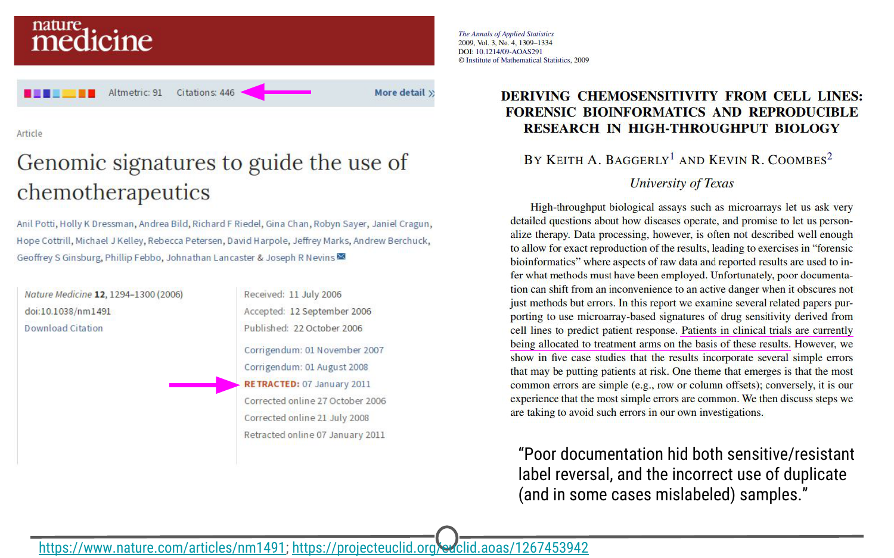
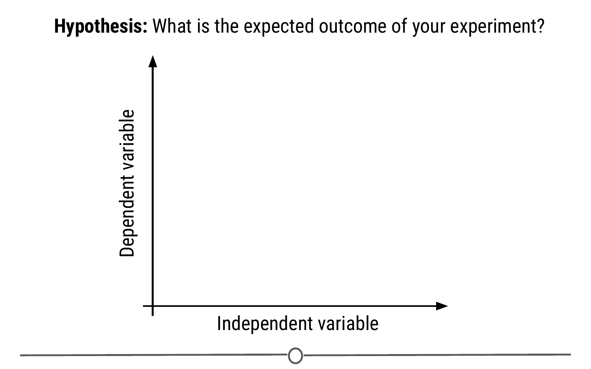
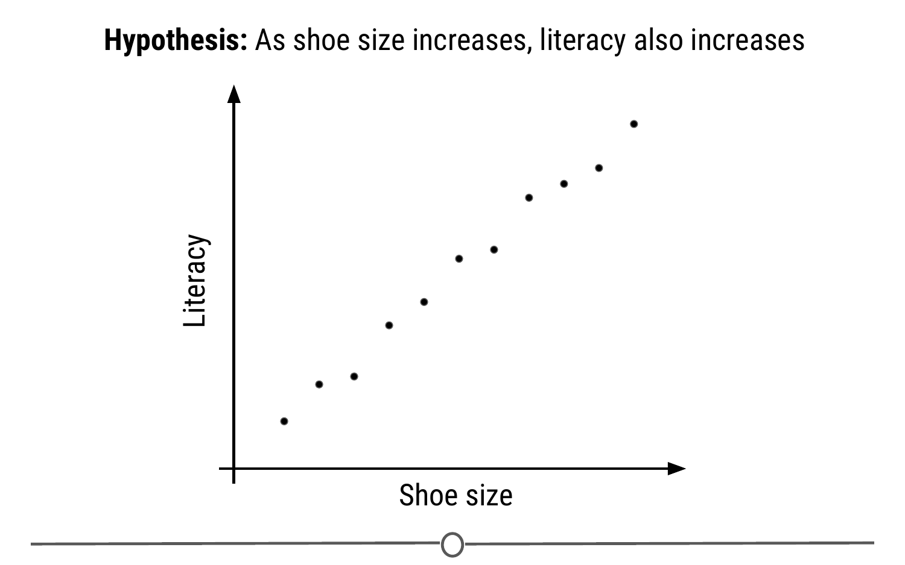
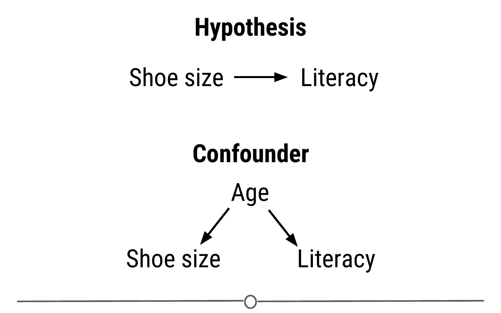
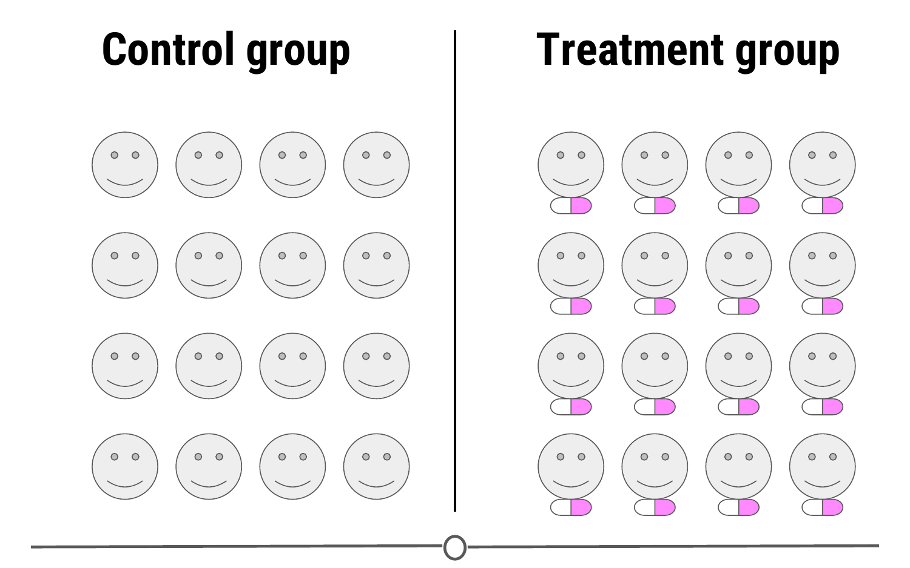
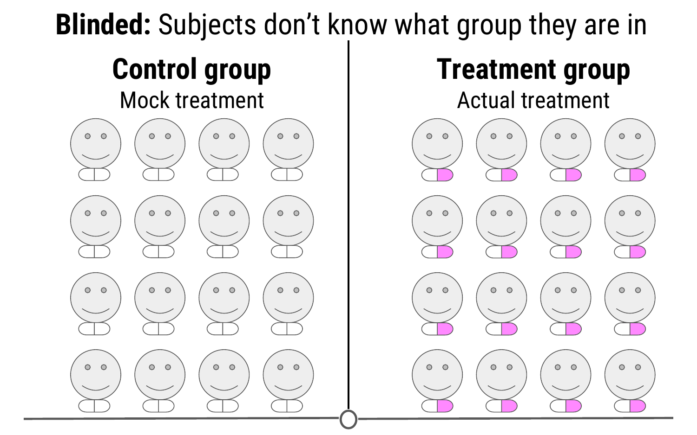
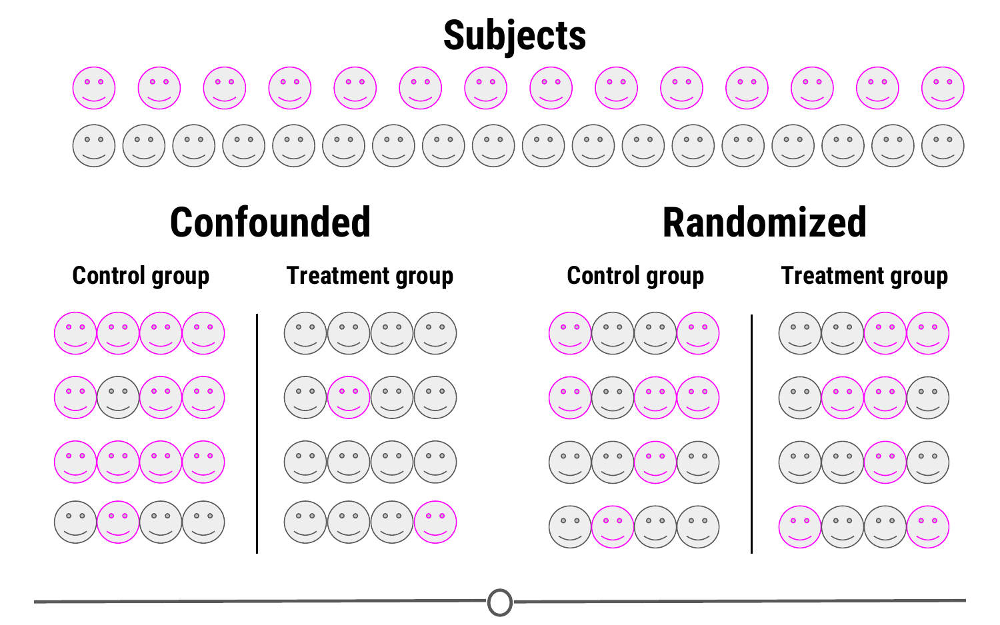
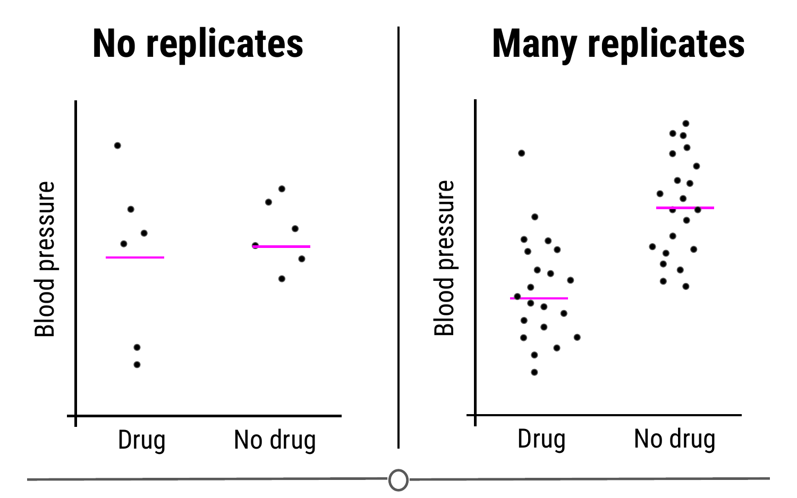

# Experimental Design

Now that we've looked at the different types of data science questions, we are going to spend some time looking at experimental design concepts. As a data scientist, you are a *scientist* and as such, need to have the ability to design proper experiments to best answer your data science questions!

### What does experimental design mean? 

Experimental design is organizing an experiment so that you have the correct data (and enough of it!) to clearly and effectively answer your data science question. This process involves clearly formulating your question in advance of any data collection, designing the best set-up possible to gather the data to answer your question, identifying problems or sources of error in your design, and only then, collecting the appropriate data. 

### Why should you care? 

Going into an analysis, you need to have a plan in advance of what you are going to do and how you are going to analyse the data. If you do the wrong analysis, you can come to the wrong conclusions! 

We've seen many examples of this exact scenario play out in the scientific community over the years - there's an entire website, [Retraction Watch](https://retractionwatch.com/), dedicated to identifying papers that have been retracted, or removed from the literature, as a result of poor scientific practices. And sometimes, those poor practices are a result of poor experimental design and analysis.

Occasionally, these erroneous conclusions can have sweeping effects; particularly in the field of human health. For example, [here](https://www.nature.com/articles/nm1491) we have a paper that was trying to predict the effects of a person's genome on their response to different chemotherapies, to guide which patient receives which drugs to best treat their cancer. As you can see, this paper was retracted, over 4 years after it was initially published. In that time, this data, which was later shown to have numerous problems in their set-up and cleaning, was cited in nearly 450 other papers that may have used these erroneous results to bolster their own research plans. On top of this, this wrongly analysed data was used in clinical trials to determine cancer patient treatment plans. When the stakes are this high, experimental design is paramount.

### Principles of experimental design

There are a lot of concepts and terms inherent to experimental design. Let's go over some of these now! 

**Independent variable (AKA factor):** The variable that the experimenter manipulates; it does not depend on other variables being measured. Often displayed on the x-axis.
  
**Dependent variable:** The variable that is expected to change as a result of changes in the independent variable. Often displayed on the y-axis, so that changes in X, the independent variable, effect changes in Y. 

So when you are designing an experiment, you have to decide what variables you will measure, and which you will manipulate to effect changes in other measured variables. Additionally, you must develop your **hypothesis**, essentially an educated guess as to the relationship between your variables and the outcome of your experiment. 

Let's do an example experiment now! Let's say for example that I have a hypothesis that as shoe size increases, literacy also increases. In this case, designing my experiment, I would choose a measure of literacy (eg: reading fluency) as my variable that *depends* on an individual's shoe size. 

To answer this question, I will design an experiment in which I measure the shoe size and literacy level of 100 individuals. **Sample size** is the number of experimental subjects you will include in your experiment. There are ways to pick an optimal sample size, that you will cover in later courses. Before I collect my data though, I need to consider if there are problems with this experiment that might cause an erroneous result. In this case, my experiment may be fatally flawed by a **confounder**.

**Confounder:** An extraneous variable that may affect the relationship between the dependent and independent variables. 

In our example, since age affects foot size and literacy is affected by age, if we see any relationship between shoe size and literacy, the relationship may actually be due to age -- age is "confounding" our experimental design!

To **control** for this, we can make sure we also measure the age of each individual so that we can take into account the effects of age on literacy, as well. Another way we could **control** for age's effect on literacy would be to **fix** the age of all participants. If everyone we study is the same age, then we have removed the possible effect of age on literacy. 

In other experimental design paradigms, a **control group** may be appropriate. This is when you have a group of experimental subjects that are *not* manipulated. So if you were studying the effect of a drug on survival , you would have a group that received the drug (**treatment**) and a group that did not (**control**). This way, you can compare the effects of the drug in the treatment versus control group. 

In these study designs, there are other strategies we can use to control for confounding effects. One, we can **blind** the subjects to their assigned treatment group. Sometimes, when a subject knows that they are in the treatment group (eg: receiving the experimental drug), they can feel better, not from the drug itself, but from knowing they are receiving treatment. This is known as the **placebo effect**. To combat this, often participants are blinded to the treatment group they are in; this is usually achieved by giving the control group a mock treatment (eg: given a sugar pill they are told is the drug). In this way, if the placebo effect is causing a problem with your experiment, both groups should experience it equally. 

  
And this strategy is at the heart of many of these studies; spreading any possible confounding effects equally across the groups being compared. For example, if you think age is a possible confounding effect, making sure that both groups have similar ages and age ranges will help to mitigate any effect age may be having on your dependent variable - the effect of age is equal between your two groups. 

This "balancing" of confounders is often achieved by **randomization**. Generally, we don't know what will be a confounder beforehand; to help lessen the risk of accidentally biasing one group to be enriched for a confounder, you can randomly assign individuals to each of your groups. This means that any potential confounding variables should be distributed between each group roughly equally, to help eliminate/reduce systematic errors. 

There is one final concept of experimental design that we need to cover in this lesson, and that is **replication**. Replication is pretty much what it sounds like, repeating an experiment with different experimental subjects. A single experiment's results may have occured by chance; a confounder was unevenly distributed across your groups, there was a systematic error in the data collection, there were some outliers, etc. However, if you can repeat the experiment and collect a whole new set of data and *still* come to the same conclusion, your study is much stronger. Also at the heart of replication is that it allows you to measure the **variability** of your data more accurately, which allows you to better assess whether any differences you see in your data are significant. 

### Sharing data

Once you've collected and analysed your data, one of the next steps of being a good citizen scientist is to share your data and code for analysis. Now that you have a GitHub account and we've shown you how to keep your version controlled data and analyses on GitHub, this is a great place to share your code! 

In fact, hosted on GitHub, our group, [the Leek group](https://github.com/jtleek/datasharing), has developed a guide that has great advice for how to best share data! 

### Beware p-hacking!

One of the many things often reported in experiments is a value called the **p-value**. This is a value that tells you the probability that the results of your experiment were observed by chance. This is a very important concept in statistics that we won't be covering in depth here, if you want to know more, check out [this](https://www.youtube.com/watch?v=UsU-O2Z1rAs) video explaining more about p-values. 

What you need to look out for is when you manipulate p-values towards your own end. Often, when your p-value is less than 0.05 (in other words, there is a 5 percent chance that the differences you saw were observed by chance), a result is considered [significant](https://xkcd.com/1478/). But if you do 20 tests, by chance, you would expect one of the twenty (5%) to be significant. In the age of big data, testing twenty hypotheses is a very easy proposition. And this is where the term [p-hacking](https://en.wikipedia.org/wiki/Data_dredging) comes from: This is when you exhaustively search a data set to find patterns and correlations that appear statistically significant by virtue of the sheer number of tests you have performed. These spurious correlations can be reported as significant and if you perform enough tests, you can find a data set and analysis that will show you what you wanted to see. 

Check out this [FiveThirtyEight](https://projects.fivethirtyeight.com/p-hacking/) activity where you can manipulate and filter data and perform a series of tests such that you can get the data to find whatever relationship you want!

[XKCD](https://xkcd.com/882/) mocks this concept in a comic testing the link between jelly beans and acne - clearly there is no link there, but if you test enough jelly bean colours, eventually, one of them will be correlated with acne at p-value < 0.05!

### Summary

In this lesson we covered what experimental design is and why good experimental design matters. We then looked in depth to the principles of experimental design and defined some of the common terms you need to consider when designing an experiment. Next, we detoured a bit to see how you should share your data and code for analysis. And finally, we looked at the dangers of p-hacking and manipulating data to achieve significance. 