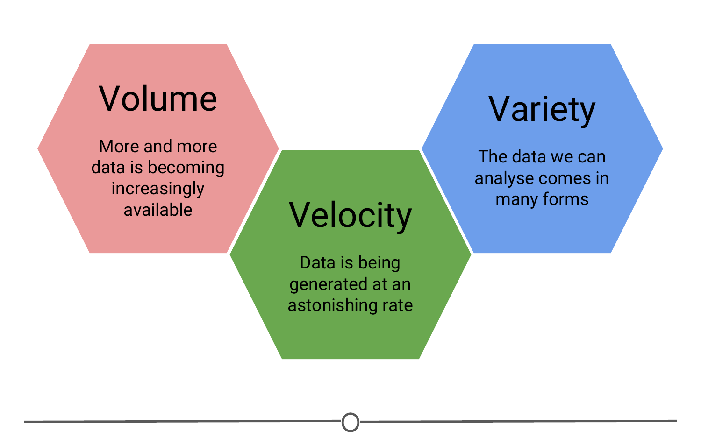
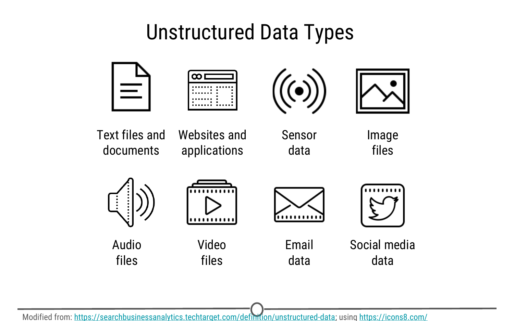
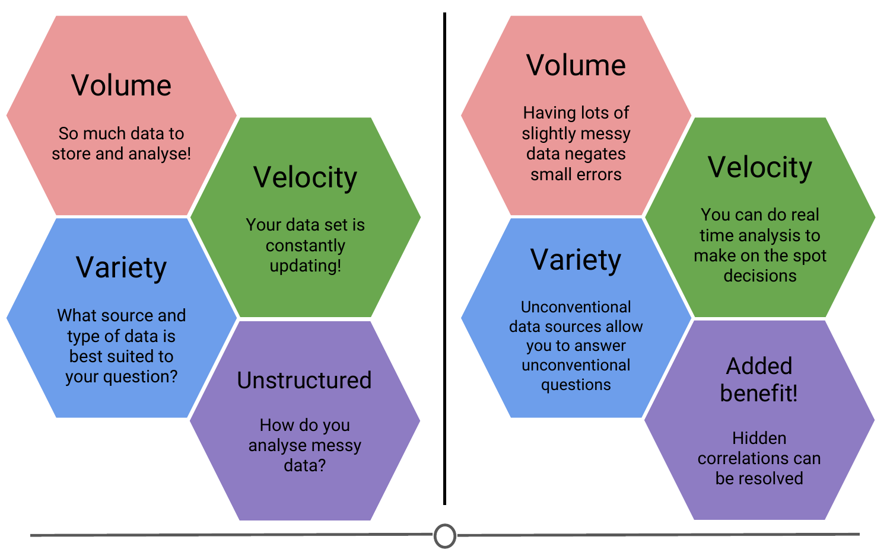

# Big Data 

A term you may have heard of before this course is "Big Data" - there have always been large datasets, but it seems like lately, this has become a buzzword in data science. But what does it mean? 

### What is big data? 

We talked a little about big data in the very first lecture of this course. As the name suggests, big data are very large data sets. We previously discussed three qualities that are commonly attributed to big data sets: Volume, Velocity, Variety. From these three adjectives, we can see that big data involves large data sets of diverse data types that are being generated very rapidly. 

So none of these qualities seem particulary new - why has the concept of big data been so recently popularized? In part, as technology and data storage has evolved to be able to hold larger and larger data sets, the definition of "big" has evolved too. Also, our ability to collect and record data has improved with time such that the speed with which data is collected is unprecedented. Finally, what is considered "data" has evolved, so that there is now more than ever - companies have recognized the benefits to collecting different sorts of information, and the rise of the internet and technology have allowed different and varied data sets to be more easily collected and available for analysis. One of the main shifts in data science has been moving from structured data sets to tackling unstructured data. 

### What is structured data? What is unstructured data? 

Structured data is what you traditionally might think of data; long tables, spreadsheets, or databases with columns and rows of information that you can sum or average or analyse however you like within those confines. Unfortunately, this is rarely how data is presented to you in this day and age. The data sets we commonly encounter are much messier, and it is our job to extract the information we want and corral it into something tidy and structured. 

With the digital age and the advance of the internet, many pieces of information that weren't traditionally collected were suddenly able to be translated into a format that a computer could record, store, search, and analyse. And once this was appreciated, there was a proliferation of this unstructured data being collected from all of our digital interactions: emails, Facebook and other social media interactions, text messages, shopping habits, smartphones (and their GPS tracking), websites you visit, how long you are on that website and what you look at, CCTV cameras and other video sources, etc. The amount of data and the various sources that can record and transmit data has exploded. 

It is because of this explosion in the volume, velocity, and variety of data that "big data" has become so salient a concept; these data sets are now so large and complex that we need new tools and approaches to make the most of them. As you can guess given the variety of data types and sources, very rarely is the data stored in a neat, ordered spreadsheet, that traditional methods for cleaning and analysis can be applied to! 

### Challenges of working with big data 

Given some of the qualities of big data above, you can already start seeing some of the challenges that may be associated with working with big data. 

1) It is big: there is a lot of raw data that you need to be able to store and analyse; 

2) It is constantly changing and updating: By the time you finish your analysis, there is even more new data you could incorporate into your analysis! Every second you are analysing, is another second of data you haven't used!

3) The variety can be overwhelming: There are so many sources of information that it can sometimes be difficult to determine what source of data may be best suited to answer your data science question! And finally,   

4) It is messy: You don't have neat data tables to quickly analyse - you have messy data. Before you can start looking for answers, you need to turn your unstructured data into a format that you can analyse! 
  
### Benefits to working with big data 

So with all of these challenges, why don't we just stick to analysing smaller, more manageable, curated datasets and arriving at our answers that way? 

Sometimes questions are best addressed using these smaller datasets, but many questions benefit from having lots and lots of data, and if there is some messiness or inaccuracies in this data, the sheer volume of it negates the effect of these small errors. So we are able to get closer to the truth even with these messier datasets. 

Additionally, when you have data that is constantly updating, while this can be a challenge to analyse, the ability to have real time, up to date information allows you to do analyses that are accurate to the current state and make on the spot, rapid, informed predictions and decisions.  

One of the benefits of having all these new sources of information is that questions that weren't previously able to be answered due to lack of information, suddenly have many more sources to glean information from and new connections and discoveries are now able to be made! Questions that previously were inaccessible now have newer, unconventional data sources that may allow you to answer these formerly unfeasible questions.

Another benefit to using big data is that it can identify hidden correlations. Since we can collect data on a myriad of qualities on any one subject, we can look for qualities that may not be obviously related to our outcome variable, but the big data can identify a correlation there - instead of trying to understand precisely why an engine breaks down or why a drug's side effect disappears, researchers can instead collect and analyze massive quantities of information about such events and everything that is associated with them, looking for patterns that might help predict future occurrences. Big data helps answer what, not why, and often that’s good enough.

### Will big data solve all our problems?

Big data has now made it possible to collect vast amounts of data, very rapidly, from a variety of sources (and improvements in technology have made it cheaper to collect, store and analyse) - but the question remains, how much of this data explosion is useful for answering questions you care about? 

Regardless of the size of the data, you need the right data to answer a question. A famous statistician, John Tukey, said in 1986, "The combination of some data and an aching desire for an answer does not ensure that a reasonable answer can be extracted from a given body of data." Essentially, any given data set may not be suited for your question, even if you really wanted it to; and big data does not fix this. Even the largest data sets around might not be big enough to be able to answer your question if it's not the right data.

### Summary 

In this lesson, we went over some qualities that characterize big data: volume, velocity, and variety. We compared structured and unstructured data, and examined some of the new sources of unstructured data. Then we turned to looking at the challenges and benefits of working with these big data sets. And finally, we came back to the idea that data science is question driven science and even the largest of data sets may not be appropriate for your case. 